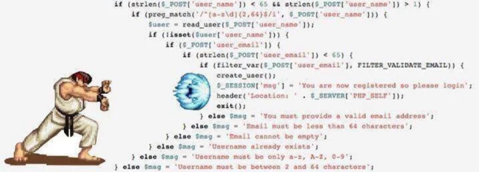

# Estruturas lógicas e condicionais

|if|else|elif
|--|--|--
|if condicao:  ....codigo |if condicao: ....codigo else: ....codigo|if condicao: ....codigo elif condicao: ....codigo else: ....codigo

A indentação é muito importante, pois é o que define blocos de código em Python! Nessa tabela, utilizamos "." para indicar a quantidade de espaço em branco necessário.

Python preza pela legibilidade, por isso existe a cláusula **elif**, ela substitui um else e um if encadeado, pois esse tipo de construção implicaria em aninhamento e queremos evitar isso:

