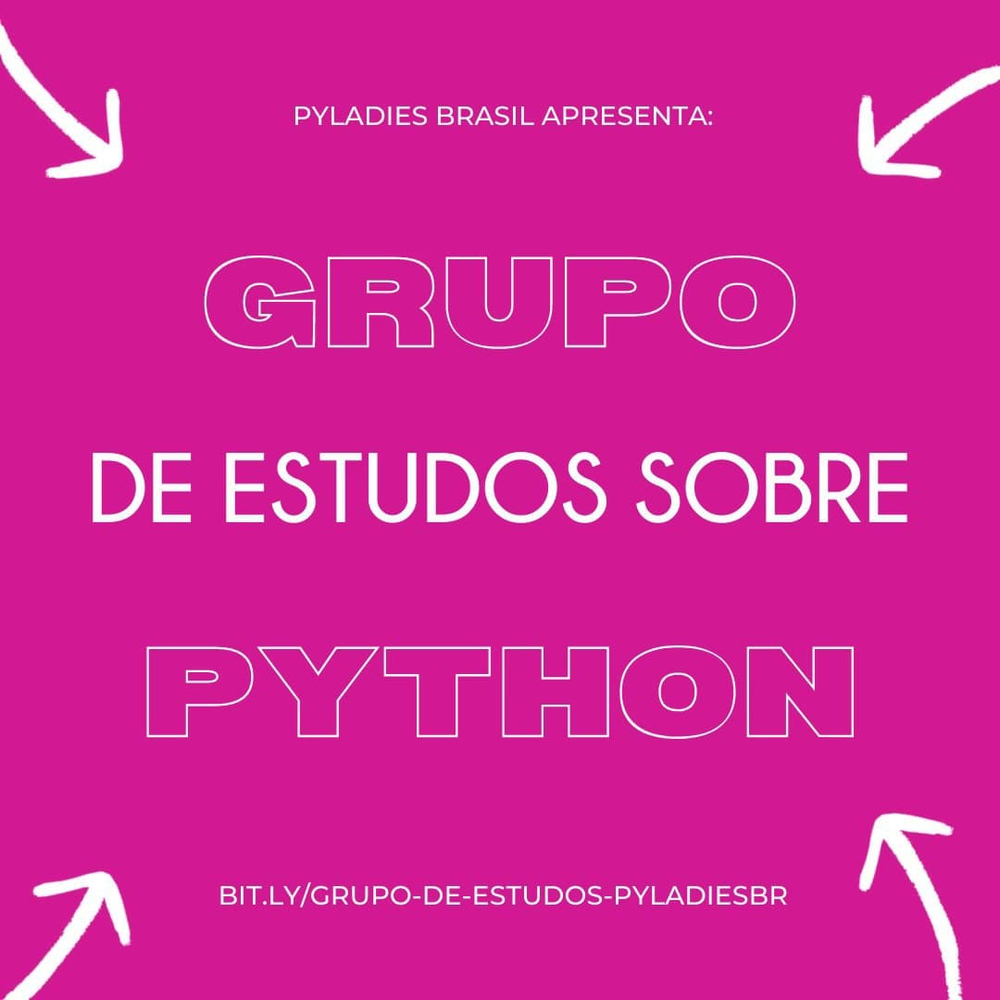
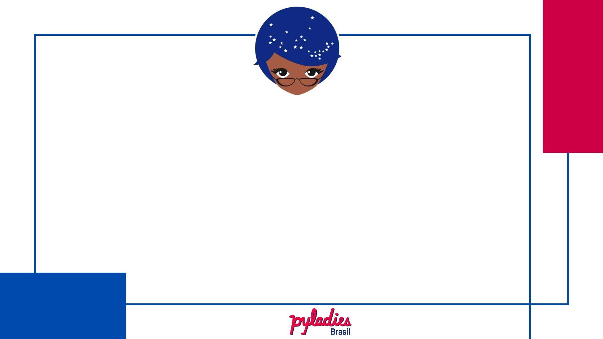
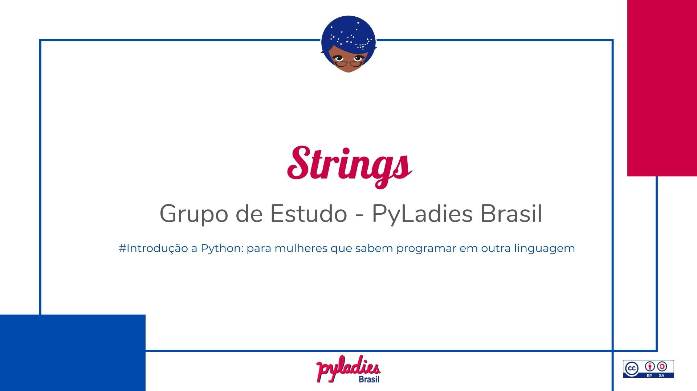

# 1. Guia da organização

No início da pandemia da Covid-19, entre maio e setembro de 2020, fizemos a série [Papo Entre PyLadies](https://youtube.com/playlist?list=PL0tfcsij9geEE-4MhGViTgeiRBIBUnlAP), conversas entre as comunidades PyLadies pelo Brasil, com objetivo de trocar conhecimento entre nós e mostrar ao público quem somos e o que fazemos. Estiveram envolvidas um total de 16 comunidades, com representações de todas as regiões do país. Os episódios estão uma delícia de assistir!!!

Como resultado, muitas mulheres e meninas entraram nas comunidades procurando apoio para aprender a programar em Python. Nesse momento surgiu a ideia de desenvolver um grupo de estudo em Python. Aqui descrevemos com detalhes a organização, desde o amadurecimento da ideia até sua execução. Você também pode ter acesso a todas as atas, entre 04 set. 2020 e 30 abr. 2021, através [desse link](https://github.com/pyladies-brazil/organizacao/issues?q=is%3Aissue+is%3Aclosed+label%3Amateriais).

**Sumário**

- [Primeiros passos](#primeiros-passos)
  - [1 - Mapeamento do perfil das novas integrantes das comunidades](#1---mapeamento-do-perfil-das-novas-integrantes-das-comunidades)
  - [2 - Convocatória para 1ª reunião](#2---convocatória-para-1ª-reunião)
  - [3 - Canal de comunicação](#3---canal-de-comunicação)
- [Escopo](#escopo)
- [Materiais desenvolvidos](#materiais-desenvolvidos)
  - [Série de vídeos](#série-de-vídeos)
    - [Roteiro](#roteiro)
    - [Edição](#edição)
    - [Descrição do vídeo no Youtube](#descrição-do-vídeo-no-youtube)
- [Identidade Visual](#identidade-visual)
- [Encontros ao vivo](#encontros-ao-vivo)

## 1.1. Primeiros passos

### 1.1.1. 1 - Mapeamento do perfil das novas integrantes das comunidades



Para entender o perfil das pessoas interessadas no grupo de estudo, entre 31 ago. e 04 set. (2021) lançamos em todas os canais de comunicação uma pesquisa com as seguintes perguntas e respostas possível:

- Qual o seu nome?
- Email:	
- Nome de usuário no Slack do PyLadies Global:
- Seu nome de usuário no Telegram:
- Com qual gênero você se identifica:
  - Feminino / Não-binário / Masculino / Prefiro não informar
- Faz parte da população T (pessoa transgênero, travesti, transexual):
  - Sim / Não
- Autodeclaração de raça:
  - Negra / Parda / Indígena / Branca / Amarela
- Você precisa de alguma adaptação do material? (PCD)
  - Sim / Não	
- Em qual UF você mora?
  - AC / AL / AP / AM / BA / CE / DF / ES / GO / MA / MT / MS / MG / PA / PB / PR / PE / PI / RJ / RN / RS / RO / RR / SC / SP / SE / TO
- E qual cidade?
- Qual a sua idade?
- Qual sistema operacional você usa?
  - Linux / Windows / MacOS
- Qual sua experiência com programação?
  - Vixi!! Saber criar uma playlist no Spotify ou abrir o Word conta? :D / Sei alguma coisa de HTML e CSS (aka. gostava de estilizar blog ou tumblr num passado distante :v) / Aprendi um pouquinho de alguma linguagem que não seja Python alguma vez na vida / Sei programar outra linguagem que não seja Python / Sei o básico (bem básico :D no máximo usar IF e FOR) de Python / Python intermediário (Programação orientada a objetos com Python, consigo usar um pouquinho de alguma biblioteca/framework) / Python avançado, manjo dos pyranauês :D
- Se você não é 100% iniciante, quer contar um pouquinho da sua experiência com programação?
- Qual sua motivação para entrar no grupo de estudos da PyLadies?	
  - Quero aprender a programar como um passatempo :D / Quero aprender a programar para mudar de área! / Já sei programar, e quero aprender Python como uma linguagem de programação alternativa. / Colaborar com a disseminação do conhecimento! Quero ensinar Python para outras mulheres <3
- Você toparia ajudar a ensinar outras mulheres?
  - Sim, mas preciso aprender primeiro :D / Claro! Só chamar! Levar a pylavra do Python por aí é minha especialidade! / Posso ficar só de monitora? (Spoilers: claro que pode, toda ajuda é bem-vinda <3) / Ministrar aulas não é muito a minha, mas posso ajudar a criar o material, serve? (Spoilers: serve, serve muito!) / Sinto muito, agora não vou conseguir ajudar.
- Como você conheceu a PyLadies?
  - Amizades / Comunidade Python / Eventos / Facebook / Familiares / Instagram / Trabalho / Twitter / Universidade/Escola
- Se você já fizer parte de alguma comunidade PyLadies, diz pra gente qual é:

Com isso identificamos dois principais perfis: pessoas que buscam o primeiro contato com a programação e pessoas que sabem programar em outra linguagen. Dada nossa pouca experiência na organização de um grupo de estudo estruturado, na [reunião do dia 04 set. 2021](https://github.com/pyladies-brazil/organizacao/issues/21) escolhemos como público alvo o grupo de mulheres que sabem programar em outra linguagem.

### 1.1.2. 2 - Convocatória para 1ª reunião

Entendemos que nossa força está na construção coletiva, por isso após o surgimento de uma ideia, a primeira coisa que fizemos foi disseminá-la e marcar uma reunião para que qualquer mulher interessada pudesse participar do seu amadurecimento e possível execução.

As convocações para reuniões foram realizadas através de envio de mensagem para lista de e-mail pyladiesbrazil@googlegroups.com, além disso foi criado um evento no Google Calendar e enviado o convite para a mesma lista.

Para ampliar a adesão de mulheres à reunião, criamos uma enquete, estilo [Doodle](https://doodle.com/), para escolha de melhor dia e horário.

### 1.1.3. 3 - Definição do canal de comunicação

Durante a [primeira reunião](https://github.com/pyladies-brazil/organizacao/issues/21) estabelecemos o Slack da PyLadies como ambiente para comunicação assíndrona, especificamente o canal #brasil-pyladies-criacao-de-material, e reuniões semanais (sextas-feiras às 19h).

## 1.2. Escopo

Para definir o conteúdo a ser abordado durante o grupo de estudo, pesquisamos materiais produzidos por capítulos PyLadies locais e cursos de introdução a python para não inciantes.

Durante nossa [segunda reunião (11 set. 2021)](https://github.com/pyladies-brazil/organizacao/issues/27), definimos o escopo e dividimos o trabalho de desenvolvimento de conteúdo em 5 subgrupos de trabalho. Além disso, estabelecemos que contaríamos a história de uma mulher inspiradora em todos os encontros presenciais.

**Conteúdo por encontro**

|Encontro |Conteúdo
|-- |--
|1º |Por quê aprender Python?<br/>PEP Variáveis<br/>Tipos básicos de dados<br/>Operadores aritméticos e relacionais<br/>Incremento, decremento e demais operações<br/>Identação<br/>Entrada e saída de dados<br/>Comentário<br/>Docstring 
|2º |Strings<br/> Operadores lógicos<br/>Estruturas lógicas e condicionais
|3º |Range<br/> Estrutura de repetição (laços e loops)
|4º |Break e Continue
|5º |Listas<br/>Map<br/>Enumerate<br/>Zip
|6º |Tuplas<br/>Dicionários<br/>Conjuntos
|7º |Função<br/>Classes

## 1.3. Materiais desenvolvidos

O conteúdo foi desenvolvido inicialmente em [slides](../../slides.pdf) e posteriormente adaptado para [e-book](https://introducao-a-python-pyladies-brasil.netlify.app/) e [série de vídeos no Youtube](../../serie_youtube.md). Os exercícios desenvolvidos durante os encontros iniciais estão disponíveis na plataforma interativa [Hackerrank](https://www.hackerrank.com/introducao-a-python-pyladies-brasil).

Buscamos desenvolver todos os materiais usando gênero neutro ou feminino, além disso todos os exemplos e atividades estão contextualizadas para a realidade da organização das comunidades locais.

### 1.3.1. Série de vídeos

Foram escolhidos os principais assuntos para serem desenvolvidos vídeos de até 20min.

#### 1.3.1.1. Roteiro

```
INFORMAÇÕES GERAIS

Aula usando slides já produzidos, sem aparecer a imagem da facilitadora.
Ferramenta para gravação: Zoom (pode ser usada qualquer outra ferramenta que mantenha
a proporção 16:9)
Slides para utilizar: Slides
Local de armazenamento: Pasta no Drive

**Roteiro Padrão**

INTRODUÇÃO

Olá, eu sou [NOME] da PyLadies [NOME DO CAPITULO] e esse é um vídeo da série
"Introdução a Python" que a rede de comunidades PyLadies no Brasil está produzindo.
Nesse vídeo vamos falar sobre [ASSUNTO PRINCIPAL DO VÍDEO].

AGENDA
Citar o(s) assunto(s) a ser(em) abordado(s) no vídeo (só citar mesmo, para que quem 
esteja assistindo saiba o que rolar)

ENCERRAMENTO

Esperamos que o vídeo tenha sido útil. Curta, compartilhe e continue conosco assistindo 
as próximas aulas. Caso tenha alguma dúvida ou queira se conectar com outras 
mulheres que estudam python, estamos no slack (deixamos o link na descrição deste vídeo). 
Só lembrando que o canal do slack é para pessoas do gênero feminino. 
Tchau, tchau e até a próxima!
```

#### 1.3.1.2. Edição

A "tela inicial" ([ver Identidade Visual](#identidade-visual)) tem duração igual ao tempo de apresentação da facilitadora do vídeo;

A "tela final" ([ver Identidade Visual](#identidade-visual)) tem duração de 15 segundos e deverá ser usada como background para linkar outros vídeos da série, preferencialmente o anterior e próximo da playlist. Sendo assim, pode ser que a mensagem final da facilitadora inicie ainde nos slides de conteúdo.

#### 1.3.1.3. Descrição do vídeo no Youtube

```
DESCRIÇÃO
Esse vídeo faz parte da série e do material de suporte do grupo de estudo "Introdução 
a Python: para mulheres que sabem programar em outra linguagem".

Slides - https://github.com/pyladies-brazil/introducao-python/blob/main/slides.pdf
e-Book - https://introducao-a-python-pyladies-brasil.netlify.app/
Slack - https://slackin.pyladies.com/

Facilitadora do vídeo
<Nome da facilitadora> (<link para contato (opcional)>)
PyLadies <cidade> (<link para contato com a comunidade>)

Autoria
Rede de comunidades PyLadies no Brasil (http://brasil.pyladies.com/)
```

## 1.4. Identidade Visual

A identidade visual foi desenvolvida colaborativamente usando a plataforma [Canva](https://www.canva.com/). A seguir o padrão utilizado:

Capa dos slides


Páginas dos slides


Tela inicial para vídeos


Última tela para vídeos


**Detalhes tipográficos:**

- Título principal: Lobster, 52px, #f7235c
- Título secundário: Nunito, 28px, #595959
- Parágrafo: Montserrat, 18px, #595959

## 1.5. Encontros ao vivo

Foram realizados 7 encontros ao vivo utilizando a plataforma [Google Meet](https://meet.google.com/) os quais seguiram a seguinte metodologia:

1. Na semana anterior: Envio do material, via e-mail, sinalizando os assuntos que serão tratados no próximo encontro;
   
2. Dinâmica de grupo nos 15 minutos iniciais dos encontros: 
   A facilitadora começa a conversar com as mulheres que tão chegando, mas também estimula que elas conversem entre si, então deve fazer uma pergunta aleatória para alguém e essa alguém deve fazer outra pergunta aleatória para outra e assim vai até que todas tenham falado ou finalizado o tempo.

3. Abertura dos encontros: 
   - Informar o público alvo do grupo de estudo,
   - Explicar a dinâmica de estudos*, 
   - Informar canal de comunicação assíncrono: Slack PyLadies, #brasil-grupo-de-estudos-python.
  
4. Encerramento: Informar sobre a leitura dos assuntos a serem trabalhados na semana seguinte e revisão dos demais materiais de apoio.

**Dinâmica de estudo**:
- Dividir total de participantes em grupos com número proporcional à capacidade de facilitadoras;
- A facilitadora passará os slides teóricos;
- Na realização de exercícios deverá ser utilizado o pairing programming e dojo em grupo (1 pessoa pilotando e as demais do grupo direcionando);
- Todas que se sintam a vontade podem contribuir nos encontros.